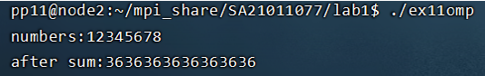
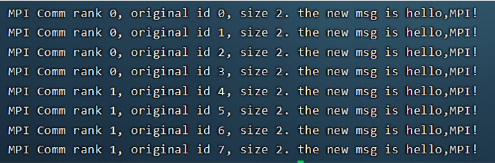
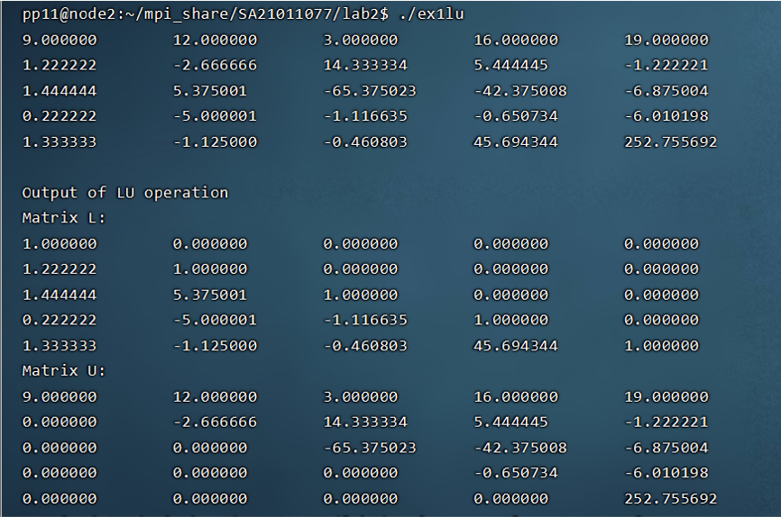

# <center> 并行程序设计实验报告  
+ lab1  
    1.  分别用omp和mpi实现树型求和和蝶式求和  
        树型omp实现思路：对每一层的计算并行化，对叶节点编号，序号值为   线程号。
        考虑兄弟结点相加时把结果存在序号较小的结点中。
        将二叉树每一次计算步骤编号为1-n步，因为任务数为2的幂次方，因    此n= log_2⁡N
        要并行化的计算是每一步的节点与兄弟节点的加法。每一步的节点序    号与兄弟节点序号的差值为2^(n−i)，i为步数。将加法交予不同的线    程并行实现。
        分发结果就是求和的逆向实现，区别在于是自上而下的。  
        ```c
        //主要代码：
            for (int i = logN; i > 0; i--)
            {
                step = (int)pow(2, logN-i+1);
            #pragma omp parallel private(pid)
                {
                    pid = omp_get_thread_num();
                    if (!(pid % step))
                    {
                        num[pid] = num[pid]+num[pid+step/2];
                    }
            #pragma omp barrier
                }
            }
            for (int i = 1; i <= logN; i++)
            {
                step = (int)pow(2, logN-i+1);
            #pragma omp parallel private(pid)
                {
                    pid = omp_get_thread_num();
                    if (!(pid % step))
                    {
                        num[pid+step/2] = num[pid];
                    }
            #pragma omp barrier
                }
            }
        ```  
        实验结果：  
          
        树型mpi实现思路：在计算全和时，在第i步，进程id整除2^(n−i    +1) 的负责接收数据并求和，其余进程负责发送数据。
        在分发全和时，在第i步，进程id整除2^(n−i+1) 的负责发送数据， 其余进程负责接收数据。
        发送与接收数据的进程编号在第i步相差2^(n−i) 。  
        ```c
        //主要代码：  
        for (int i = 1; i <= logN; i++)
        {
            int tag = i;
            int step = (int)pow(2, i);
            if (pid % step == 0)
            {
                MPI_Recv(&recvdata, 1, MPI_INT, pid+step/2,     tag, MPI_COMM_WORLD, &status);
                data += recvdata;
            }
            else
             if(pid % step == step/2)
            {
                MPI_Send(&data, 1, MPI_INT, pid-step/2, tag,    MPI_COMM_WORLD);
            }
        }
        //spread
        for (int i = logN; i >0; i--)
        {
            int tag = i;
            int step = (int)pow(2, i);
            if (pid % step == 0)
            {
                MPI_Send(&data, 1, MPI_INT, pid+step/2, tag,    MPI_COMM_WORLD);
            }
            else
            if(pid % step == step/2)
            {
                MPI_Recv(&recvdata, 1, MPI_INT, pid-step/2,     tag, MPI_COMM_WORLD, &status);
                data = recvdata;
            }

        }    
        ```  
        实验结果：  
           
        蝶式求和omp实现思路：仍然是对每一步的计算并行化，对叶节点编 号，序号值为线程号。考虑兄弟结点相加时把结果存在序号较小的结 点中。
        依然将计算步骤编号从开始到结束编为1-n步，因为任务数为2的幂次    方，因此n= log_2⁡N
        要并行化的计算是每一步的节点与兄弟节点的加法。关键在于如何确    定相加节点的序号差值。
        将编号写为n位的二进制格式，可以发现，在第i步，相加的节点序号    恰好在第i位不同，而其余位都相同。
        ```c
        //主要代码：
        for (int i = 0; i < logN; i++)
        {
            step = (int)pow(2, i);
        #pragma omp parallel private(pid, tmp, dest)
            {
                pid = omp_get_thread_num();
                tmp = num[pid];
                dest = pid^step;
                tmp = num[pid] + num[dest];
        #pragma omp barrier
                num[pid] = tmp;
        #pragma omp barrier
            }
        }
        ```  
        实验结果：  
        
        蝶式求和mpi实现思路：思路与omp实现相同，区别在于不用关心哪两    个节点相加，
        此时发送目的进程和接受来源进程的id的二进制格式在第i步时的第i    位不同。  
        ```c
        //主要代码：  
        int logN = (int)log2(num_procs);
        for(int i = 0; i < logN; i++) {
            int tag = i+1;
            int step = (int)pow(2,i);
            int dest = id_procs ^ step;
            MPI_Send(&data, 1, MPI_INT, dest, tag,  MPI_COMM_WORLD);
            MPI_Recv(&recvdata, 1, MPI_INT, dest, tag,  MPI_COMM_WORLD, &status);
            data += recvdata;
        }
        ```  
        实验结果：  
          
    2. 对作业中有并行化要求的题目代码实现  
        ```c
        //hw21-1-3
        #pragma omp simd
        for (int i = 0; i < n; i++)
        {
            a[i] = b[i] + c[i+1];
            c[i] = a[i] + b[i];
        }
        ```  
        ```c
        //hw21-3-2 
        for (int i = 0; i < count; i++)
        {
            for (int j = 0; j < count-1; j++)
            {
                b[j] = a[j][N];
                #pragma omp parallel for
                for (int k = 0; k < count; i++)
                {
                    a[j+1][k] = b[j] + c[j][k];
                }
            }
        }
        for (int i = 0; i < count; i++)
        {
            /* code */
            #pragma omp parallel for
            for (int j = 0; j < count-1; i++)
            {
                y[i+j] = a[j+1][N];
            }
        }
        #pragma omp parallel for
        for (int i = 0; i < count; i++)
        {
            /* code */
            x[i] = y[i] + 10;
        }
        ``` 
        ```c
        //hw21-3-5
        //loop1
        #pragma omp parallel for
        for (int i = 1; i <= 100; i++)
        {
            /* code */
            A[i] = A[i] + B[i-1];
            D[i] = C[i] * C[i];  

        }
        //loop2
        #pragma omp parallel for
        for (int i = 1; i <= 500; i++)
        {
            A[i] = B[i] + C[i];
            D[i] = (A[i] + A[1000-i])/2.0;
        }
        #pragma omp parallel for
        for (int i = 501; i < count; i++)
        {
            /* code */
            A[i] = B[i] + C[i];
            D[i] = (A[i]+A[1000-i])/2.0;
        }
        //loop3
        #pragma omp parallel for
        for (int i = 0; i < count; i++)
        {
            for (int j = 0; i < count; j++)
            {
                A[3*i+2*j][2*j] = C[i][j]*2;
                D[i][j] = A[(i-j+6)>0 ? (i-j+6):-(i-j+6)][i+j];
            }   
        }
        ```  
    3. 实现MyBcast()  
        思路：  
            （1）将MPI进程按所在节点划分子通讯域N；  
            （2）可以将各子通讯域的首进程（编号为0）再组成一个子通讯域H；  
            （3）由广播的root进程将消息发给原来最大通讯域中的0号进程h，再由h在H通讯域中广播（MPI_Bcast），各首进程然后在各自子通讯域N中再行广播（MPI_Bcast）；  
            （4）子通讯域H：将N的首进程通过MPI_Group_incl()函数建立一个组，再用MPI_Comm_create()建立子通讯域H。  
        ```
        //伪代码
        MPI_Comm_split(MPI_COMM_WORLD, color, key, &split_comm_world);
        建立MPI_COMM_WORLD的进程组World_Group；
        通过World_Group建立h_Group；
        PI_Comm_create(MPI_COMM_WORLD, h_Group, &h_comm_world)；
        oot进程发送消息：
        	MPI_Send(data, count, MPI_TYPE, 0, 1, MPI_COMM_WORLD);
        原通讯域的0号进程接收：
            MPI_Recv(data, count, MPI_TYPE, root, 1, MPI_COMM_WORLD,&status);
        号进程在H中广播：
        	 MPI_Bcast(data, count, MPI_TYPE, 0, h_comm_world);
        在N中广播
        	 MPI_Bcast(data, count, MPI_TYPE, 0, split_comm_world);
        ```
        ```c
        //主要代码：
        MPI_Comm h_comm_world;
        MPI_Comm_group(MPI_COMM_WORLD, &world_group);
        int grpsize = num_procs / 2;
        int zerolist[] = {0, 1, 2, 3};
        int zerocnt = 0;

        MPI_Group_incl(world_group, grpsize, zerolist, &    new_group);
        MPI_Comm_create(MPI_COMM_WORLD, new_group, &    h_comm_world);
        // message from root to 0 proc of MPI_COMM_WORLD
        if (id_procs == root)
        {
            MPI_Send(&seq, 16, MPI_CHAR, 0, 1, MPI_COMM_WORLD);
        }
        else if (id_procs == 0)
        {
            MPI_Recv(&seq, 16, MPI_CHAR, root, 1,   MPI_COMM_WORLD, &status);
        }
        MPI_Barrier(MPI_COMM_WORLD);
        // Broadcast within the group H
        if(h_comm_world != MPI_COMM_NULL)
            MPI_Bcast(&seq, 16, MPI_CHAR, 0, h_comm_world);
        MPI_Barrier(MPI_COMM_WORLD);
        //Broadcasr within the group N

        MPI_Bcast(&seq, 16, MPI_CHAR, 0, split_comm_world);
        MPI_Barrier(MPI_COMM_WORLD);
        ```
        实验结果：  
          
    4.   
        用MPI_Send和MPI_Recv来模拟实现诸如MPI_Alltoall,      MPI_Allgather功能并与标准MPI实现做简要性能对比.  
        ```c
        //MPI_Alltoall实现
        void MPI_Alltoall_my(int* senddata, int sendcount, MPI_Datatype senddatatype, int* recvdata, int recvcount,
        MPI_Datatype recvdatatype, MPI_Comm comm)
        {
            int rank, size;
            MPI_Status status;
            MPI_Comm_rank(comm, &rank);
            MPI_Comm_size(comm, &size);
            for (int i = 0; i < size; i++)
            {
                if (i != rank)
                {
                    MPI_Send(senddata + i * sendcount, sendcount,       senddatatype, i, rank , comm);
                    MPI_Recv(recvdata + i * recvcount, recvcount,       recvdatatype, i, i, comm, &status);
                }
                else
                {
                	//memcpy(recvdata + i * recvcount, senddata,        sizeof(senddatatype)*sendcount);
                	recvdata[i] = senddata[i];
                }
            }
        }
        ```
        ```c
        //MPI_Allgather实现  
        void MPI_Allgather_my(int* senddata, int sendcount, MPI_Datatype senddatatype, int* recvdata, int recvcount,
        MPI_Datatype recvdatatype, MPI_Comm comm)
        {
            int rank, size, i;
            MPI_Status status;
            MPI_Comm_rank(comm, &rank);
            MPI_Comm_size(comm, &size);

            for (i = 0; i < size; i++)
            {
                if (i != rank)
                {
                    MPI_Send(senddata, sendcount, senddatatype, i,      rank , comm);
                    MPI_Recv(recvdata + i * recvcount, recvcount,       recvdatatype, i, i, comm, &status);
                }
                else
                {
                	//memcpy(recvdata + i * recvcount, senddata,        sizeof(senddatatype)*sendcount);
                	recvdata[i] = *senddata;
                	}
            }
        }
        ```  
        性能对比：  
          
          
+ lab2  
    1. 用mpi和omp实现LU分解  
        + 原理  
	    利用主行i对j >i的其他行做初等行变换，由于各行计算时没有数据相关，因此可以对矩阵按行划分做并行计算。课本的并行算法考虑到各处理器之间的负载均衡，使用的是交叉行划分。划分后各处理器轮流选出主行并广播给其他处理器，其他处理器利用接收的主行对部分行向量进行计算。
        + 思路  
	    在课本第18章附录2的LU分解的MPI实现上，对处理器用主行做行变换的循环部分用openmp实现for编译制导，将计算平均分给各线程处理，其他不动。  
        ```c
        //主要代码部分  
        if (my_rank<=j)
        {
           #pragma  omp parallel shared(a,f,v,m) private(k,w)
           {
                #pragma omp for
                for(k=i+1;k<m;k++)
                {
                    a(k,v)=a(k,v)/f[v];
                }
                for(k=i+1;k<m;k++)
                {
                    #pragma omp for
                    for(w=v+1;w<M;w++)
                        a(k,w)=a(k,w)-f[w]*a(k,v);
                }
            }
        }
        /*编号大于my_rank的进程利用主行对其第i,…,m-1行数据做行变换*/
        if (my_rank>j)
        {
            #pragma  omp parallel shared(a,f,v,m) private(k,w)
            {
                #pragma omp for
                for(k=i;k<m;k++)
                {
                    a(k,v)=a(k,v)/f[v]; 
                }
                for(k=i;k<m;k++)
                {
                    #pragma omp for
                    for(w=v+1;w<M;w++)
                        a(k,w)=a(k,w)-f[w]*a(k,v);
                }
            }
        }
        ```    
        实验结果(只跑了6维矩阵和5维矩阵作为演示):      
          
          
        性能对比：  
        |线程数|100 * 100|1000 * 1000|10000 * 10000|  
        |---|----|----|---|  
        |2|0.1143s|0.55024s|237.638s|
        |4|0.0968s|0.508s|229.686s|  
        |8|0.1019s|0.349117s|201.801s|  
    2. 用纯omp实现QR分解  
        QR分解的串行算法有三层循环，直接对最内层循环做并行化处理。  
        ```c
        //主要代码  
        for(int j = 0; j < N; j++){
            for (int i = j+1; i < N; i++)
            {
                sq = sqrt(A(j, j) * A(j, j) + A(i, j) * A(i, j));
                c = A(j, j)/sq;
                s = A(i, j)/sq;
                int k ;
            #pragma omp parallel for private(k)
                for (k = 0; k < N; k++)
                {
                    Aj[k] = c * A(j, k) + s * A(i, k);
                    Qj[k] = c * Q(j, k) + s * Q(i, k); 
                    Ai[k] = - s * A(j, k) + c * A(i, k);
                    Qi[k] = - s * Q(j, k) + c * Q(i, k);
                }
            #pragma omp parallel for private(k)
                for (k = 0; k < N; k++)
                {
                    A(j, k) = Aj[k];
                    A(i, k) = Ai[k];
                    Q(i, k) = Qi[k];
                    Q(j, k) = Qj[k];
                }         
            }
        }
        ```
        性能对比：  
        |线程数|矩阵维数n=8|矩阵维数n=16|矩阵维数n=32|  
        |----|-----|-----|-----|  
        |1|0.000073|0.000293|0.001481|
        |2|0.000182|2.136728|0.002181|
        |4|0.434824|4.581992|0.004917|
        |8|1.970921|10.218330|45.5784|  
        分析：  
        我们惊讶的发现，即使不考虑节点自身的问题————如运算资源在被其他程序所消耗等，线程数增加后，运行时间反而增大了。特别是在线程数增加到8后，对32维矩阵的QR分解时间增大到一种吓人的地步。我从知乎上得到了一个很有说服力的解释：  
        嵌套循环，内层循环并行。并行线程的创建与销毁会有开销，在嵌套循环的时候如果对内层for并行的话，这个开销会很大。解决方法是把并行放在外层的for。  
    3. 用mpi实现summa算法  
        原理：  
          
          
        ```c
        //主要代码
            //将数据发送到0号进程收集显示
        MPI_Send(A,localHighA*localLenA,MPI_INT,0,rank+100, MPI_COMM_WORLD);
        MPI_Send(B,localHighB*localLenB,MPI_INT,0,rank+200, MPI_COMM_WORLD);
	    if(rank==0)
	    {
	    	int **matrixA=(int **)malloc(matrixHighA*sizeof(int*));
	    	for (i=0;i<matrixHighA;i++)
	    		matrixA[i]=(int *)malloc(matrixLenA*sizeof(int));
	    	int **matrixB=(int **)malloc(matrixHighB*sizeof(int*));
	    	for (i=0;i<matrixHighB;i++)
	    		matrixB[i]=(int *)malloc(matrixLenB*sizeof(int));
            for(i=0;i<nodeNum;i++)
            {
                int *receiveATemp=(int *)malloc    (localLenA*localHighA*sizeof(int));
                int *receiveBTemp=(int *)malloc    (localLenB*localHighB*sizeof(int));
                MPI_Recv(receiveATemp,localHighA*localLenA,    MPI_INT,i,i+100,MPI_COMM_WORLD,&status);
                MPI_Recv(receiveBTemp,localHighB*localLenB,    MPI_INT,i,i+200,MPI_COMM_WORLD,&status);
                l=0;
                for(j=0;j<localHighA;j++)
                    for(k=0;k<localLenA;k++)
                    {
                        matrixA[j+(int)(i/p)*localHighA][k+(int)(i%p)*localLenA]=receiveATemp[l++];
                    }
                l=0;
                for(j=0;j<localHighB;j++)
                    for(k=0;k<localLenB;k++)
                    {
                        matrixB[j+(int)(i/p)*localHighB][k+(int)(i%p)*localLenB]=receiveBTemp[l++];
                    }
                free(receiveATemp);
                free(receiveBTemp);  
            }  
            printf("A:\n");
            PrintMatrix(matrixA,matrixHighA,matrixLenA);
            printf("B:\n");
            PrintMatrix(matrixB,matrixHighB,matrixLenB);
            for (i=0;i<matrixHighA;i++)
                free(matrixA[i]);
            for (i=0;i<matrixHighB;i++)
                free(matrixB[i]);
            free(matrixA);
            free(matrixB);
	    }
        for(i=0;i<p;i++) //每个节点向同行同列发送局部数据 A B
	    {
	        {
	    	    MPI_Send(A,localHighA*localLenA,MPI_INT，myRow*p+i,1,MPI_COMM_WORLD);
	    		MPI_Send(B,localHighB*localLenB,MPI_INT,myRow*p+i,2,MPI_COMM_WORLD);
	    	}
	    	{
	    	   MPI_Send(A,localHighA*localLenA,MPI_INT,i*p  +myCol,1,MPI_COMM_WORLD);
	    	   MPI_Send(B,localHighB*localLenB,MPI_INT,i*p +myCol,2,MPI_COMM_WORLD);		
	    	}	
	    }
	    int *receiveA=(int *)malloc(localLenA*localHighA*sizeof(int));
	    int *receiveB=(int *)malloc(localLenB*localHighB*sizeof(int));
        int *resultC= (int *)malloc(localHighA*localLenB*sizeof(int));
	    for(i=0;i<localHighA*localLenB;i++)resultC[i]=0;
	    for(i=0;i<p;i++)
	    {
	    	MPI_Recv(receiveA,localHighA*localLenA,MPI_INT, myRow*p+i,1,MPI_COMM_WORLD,&status);
	    	MPI_Recv(receiveB,localHighB*localLenB,MPI_INT,i*p+myCol,2,MPI_COMM_WORLD,&status);
            MatrixMultiply(receiveA,receiveB,resultC,localHighA,localLenA,localLenB);
	    	MatrixAdd(C,resultC,localHighA,localLenB);	
	    }
        MPI_Send(C,localHighA*localLenB,MPI_INT,0,rank+400,    MPI_COMM_WORLD);//将局部结果C发送至0号收集
        if(rank==0)//收集数据并且在后面显示
        { 
            int **matrixC=(int **)malloc(matrixHighA*sizeof(int *));
            for (i=0;i<matrixHighA;i++)
                matrixC[i]=(int *)malloc(matrixLenB*sizeof(int));
            for(i=0;i<nodeNum;i++)
            {
               int *receiveCTemp=(int *)malloc     (localLenB*localHighA*sizeof(int));
               MPI_Recv(receiveCTemp,localHighA*localLenB, MPI_INT,i,i+400,MPI_COMM_WORLD,&status);
               l=0;
               for(j=0;j< localHighA;j++)
                   for(k=0;k< localLenB;k++)
                   {
                       matrixC[j+(int)(i/p) *localHighA][k+(int)(i%p)*localLenB]=receiveCTemp[l++];
                   }
               free(receiveCTemp);
            }
            printf(" C:\n");
            PrintMatrix(matrixC,matrixHighA,matrixLenB); 
        } 
        ```
        性能对比：  
        |length/process number|1|2|4|8|  
        |-----|-----|----|----|----|  
        |16|0.000023|0.000051|0.000148|1.002412|  
        |256|0.129714|0.043931|0.023101|0.011794|  
        |1024|9.266333|1.976020|1.265144|0.594526|  
